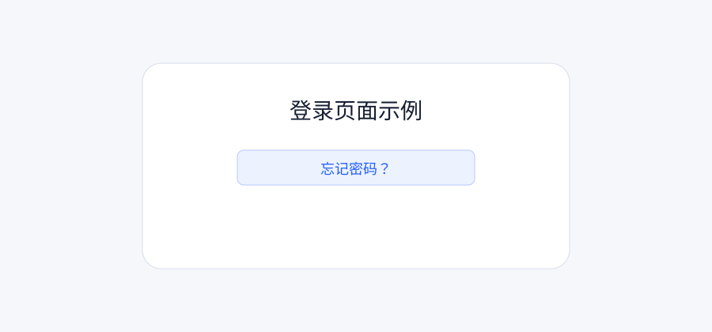

## 使用邮箱重置密码

进入登录页，点击“忘记密码”。

## 常见问题

如果没有收到邮件，请检查垃圾邮箱。

## 本地更新测试

这段内容是后续追加的，用来验证重新发布后页面会更新。

## GitHub Webhook Push 测试

这段内容用于验证 push 后自动触发本地 NestJS 发布。

## Worker 队列测试

这段内容用于验证 GitHub webhook 入队后，由 Worker 进程完成发布。
